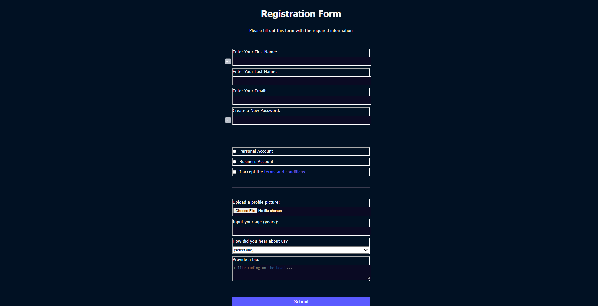

# Project Title: Registration Form

## Description
HTML forms to collect information from people who visit my webpage. Employing different methods of what types of data people can type into a form, and CSS for styling.

## Technologies Used
- HTML
- CSS

## Installation Instructions
To view this project click on this link: https://92d7229c-68fa-452f-877a-0f0fdedabc68-00-3kwncojjptaut.picard.replit.dev/ or copy and paste it into your browser.

## Contributors
- dev-jaser

## Preview
