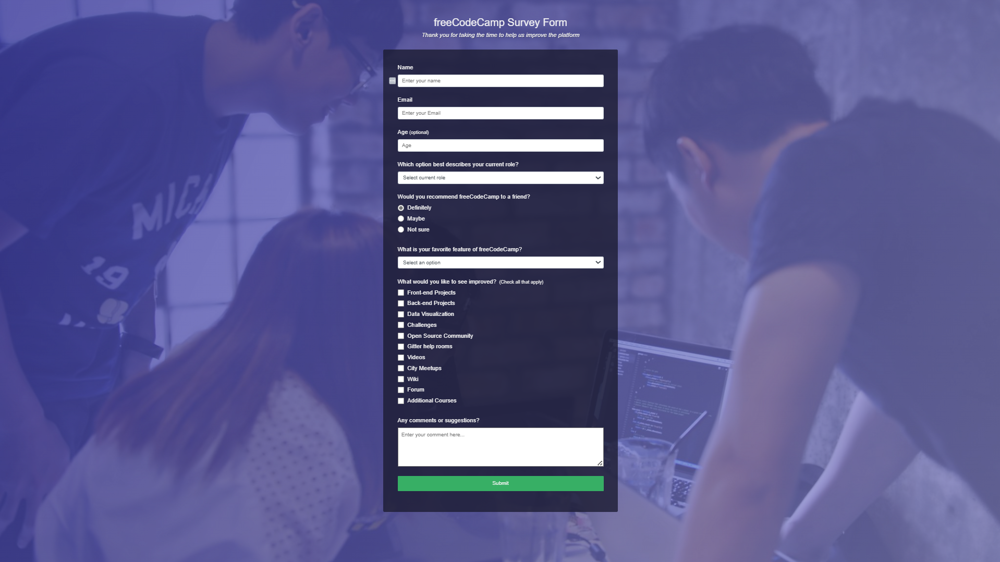

# Project Title: Survey Form

## Description
A responsive survey form. This project demonstrates the use of HTML, CSS, and basic form elements to collect user feedback. The form includes various input types such as text, email, number, dropdowns, radio buttons, checkboxes, and a textarea for comments.

## Technologies Used
- HTML
- CSS

## Installation Instructions
To view this project click on this link: https://92d7229c-68fa-452f-877a-0f0fdedabc68-00-3kwncojjptaut.picard.replit.dev/ or copy and paste it into your browser.

## Contributors
- dev-jaser

## Preview
