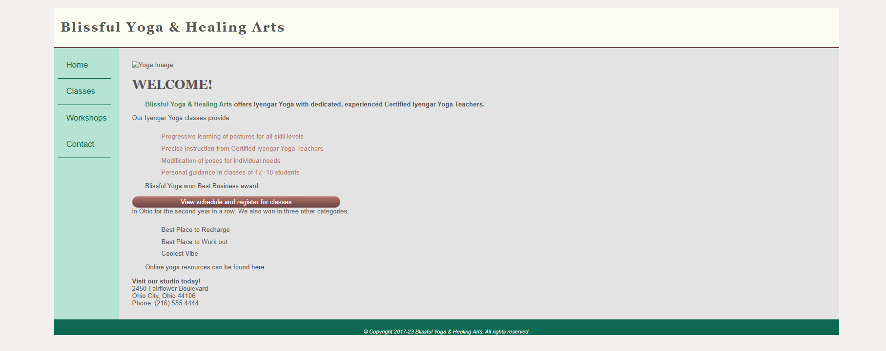

# Project Title: Blissful Yoga and Healing Arts

## Description
This project features a static website for "Blissful Yoga & Healing Arts," a yoga studio offering Iyengar Yoga classes. The site provides information about the studio, its classes, workshops, and contact details. It showcases a clean and responsive design, with a focus on usability and visual appeal.

## Features
- Header Section: Displays the studio's name and welcome message.
- Navigation Bar: Provides links to key sections of the website including Home, Classes, Workshops, and Contact.
- Main Content:
    Highlights the services offered by the studio.
    Lists class features and awards.
    Provides contact information and links to online resources.
- Footer: Contains copyright information and branding.

## Technologies Used
- HTML: Structure of the web pages.
- CSS: Styling and layout (linked as styles.css).
- JavaScript: Additional functionality (linked as script.js).

## Installation Instructions
To view this project click on this link: https://92d7229c-68fa-452f-877a-0f0fdedabc68-00-3kwncojjptaut.picard.replit.dev/ or copy and paste it into your browser.

## Contributors
- dev-jaser

## Preview
