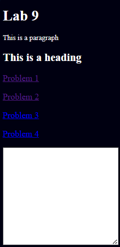

# Project Title: Events and Traversals

## Description
This project consists of several HTML files showcasing different JavaScript functionalities related to events and DOM manipulations. The goal is to demonstrate various aspects of event handling and traversal in web development.

## Files and Features
*index.html*
- Description: Provides an overview page with links to different problems and a textarea for user input.
- Features:
    Links to problem1.html, problem2.html, problem3.html, and problem4.html.
    A textarea for user input.

*problem1.html*
- Description: Demonstrates changing the color of a text element using JavaScript.
- Features:
    A button that changes the color of a paragraph text to red when clicked.

*problem2.html*
- Description: Shows how to animate an element across the screen.
- Features:
    Animates a div element horizontally across the screen using requestAnimationFrame.

*problem3.html*
- Description: Toggles the visibility of a heading element when a button is clicked.
- Features:
    A button that toggles the display of a heading between block and none.

*problem4.html*
- Description: Allows users to add and remove list items dynamically.
- Features:
    An input field and a button to add items to a list.
    A button to remove the last item from the list.

## Technologies Used
- HTML: Structure of the web pages.
- CSS: Styling and layout (linked as styles.css).
- JavaScript: Event handling and DOM manipulation.

## Installation Instructions
To view this project click on this link: https://92d7229c-68fa-452f-877a-0f0fdedabc68-00-3kwncojjptaut.picard.replit.dev/ or copy and paste it into your browser.

## Contributors
- dev-jaser

## Preview
