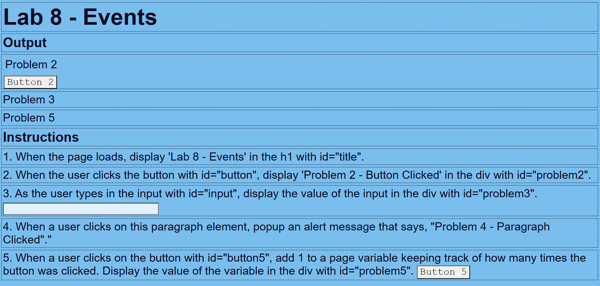

# Project Title: Events

## Description
This project demonstrates various JavaScript event handling techniques through different interactive elements on a web page. It covers updating content dynamically, handling user input, and managing click events.

## Files and Features
*index.html*
- Description: A single HTML file that showcases multiple JavaScript functionalities as part of Lab 8.
- Features:
    Title Update: The <h1> element with id="title" is updated to "Lab 8 - Events" when the page loads.
    Button Click: Clicking the button with id="button" updates the content of the 
 with id="problem2" to "Problem 2 - Button Clicked".
    Input Handling: As the user types in the input field with id="input", the 
 element with id="problem3" is updated to reflect the current input value.
    Paragraph Click: Clicking on a paragraph triggers an alert with the message "Problem 4 - Paragraph Clicked".
    Button Counter: Clicking the button with id="button5" increments a counter and updates the 
 with id="problem5" to show how many times the button has been clicked.

## Technologies Used
- HTML: Structure of the web page.
- CSS: Styling and layout (linked as styles.css).
- JavaScript: Event handling and dynamic content updates.

## Installation Instructions
To view this project click on this link: https://92d7229c-68fa-452f-877a-0f0fdedabc68-00-3kwncojjptaut.picard.replit.dev/ or copy and paste it into your browser.

## Contributors
- dev-jaser

## Preview
