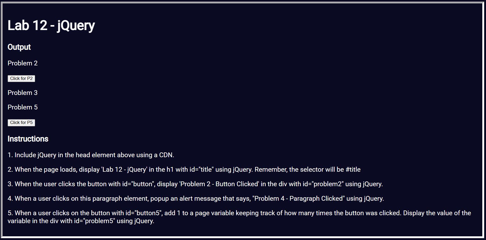

# Project Title: jQuery Lab

## Description
This project demonstrates the use of jQuery to handle various interactive elements on a web page. It includes functionalities like updating content dynamically, handling click events, and using jQuery methods for DOM manipulation.

## Files and Features
*index.html*
- Description: This HTML file showcases different JavaScript and jQuery functionalities for handling user interactions and dynamic content updates.
- Features:
    Title Update: When the page loads, the `<h1>` element with `id="title"` is updated to "Lab 12 - jQuery" using jQuery.
    Button Click: Clicking the button with `id="button"` updates the content of the `
` element with `id="problem2"` to "Problem 2 - Button Clicked" using jQuery.
    Paragraph Click: Clicking the `
` element with `id="problem3"` triggers an alert with the message "Problem 4 - Paragraph Clicked" using jQuery.
    Button Counter: Clicking the `button` with `id="button5"` increments a counter and updates the `
` element with `id="problem5"` to show how many times the button has been clicked using jQuery.

## Technologies Used
- `HTML`: Structure of the web page.
- `CSS`: Styling and layout (linked as styles.css).
- `JavaScript`: General scripting (included in inline `<script>` tags).
- `jQuery`: For DOM manipulation and event handling (included via `CDN`).

## Installation Instructions
To view this project click on this link: https://92d7229c-68fa-452f-877a-0f0fdedabc68-00-3kwncojjptaut.picard.replit.dev/ or copy and paste it into your browser.

## Contributors
- dev-jaser

## Preview
