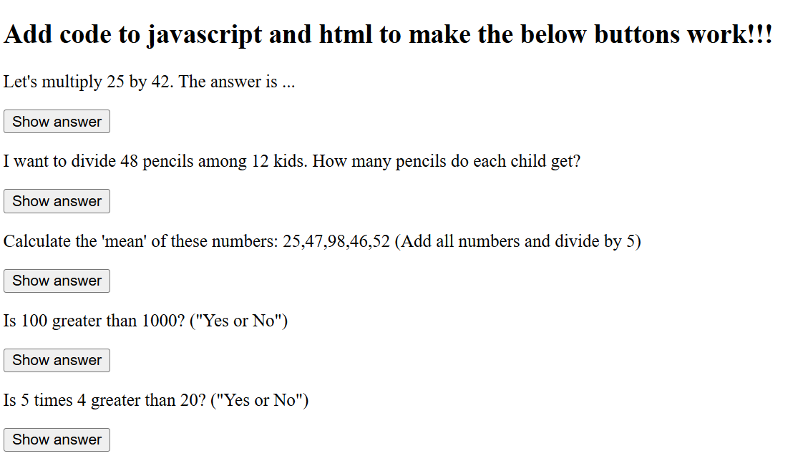

# Project Title: JavaScript Basics Lab

## Description
This project demonstrates fundamental JavaScript functionalities and interactions with HTML elements. The purpose of this demo is to showcase basic operations, event handling, and dynamic updates to the webpage using JavaScript.

## Features
`Multiplication Operation`: Computes and displays the result of multiplying two numbers (25 and 42) when the user clicks the "Show answer" button.
`Division Operation`: Calculates and shows the result of dividing 48 pencils among 12 kids, indicating how many pencils each child gets.
`Mean Calculation`: Computes the mean (average) of a set of numbers (25, 47, 98, 46, 52) and displays the result.
`Comparison`: Checks whether 100 is greater than 1000 and provides a "Yes" or "No" response.
`Multiplication Comparison`: Evaluates if 5 times 4 is greater than 20 and shows a "Yes" or "No" result.

## Technologies Used
- `HTML`: For the structure of the webpage.
- `JavaScript`: For implementing the logic and interactions.
- `jQuery`: For simplified DOM manipulation and event handling.

## Installation Instructions
To view this project click on this link: https://92d7229c-68fa-452f-877a-0f0fdedabc68-00-3kwncojjptaut.picard.replit.dev/ or copy and paste it into your browser.

## Contributors
- dev-jaser

## Preview
