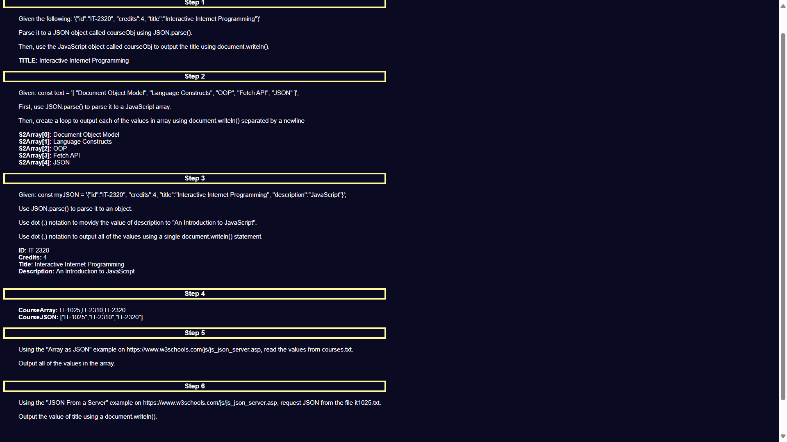

# Project Title: JSON and JavaScript Integration Demo

## Description
This project demonstrates various JavaScript functionalities related to JSON data handling. It includes parsing JSON data, manipulating JSON objects, and fetching JSON data from files using JavaScript. The project is structured into multiple steps, each illustrating different aspects of JSON handling.

## Features
`Step 1`: Parsing a JSON string to an object and displaying a property.
`Step 2`: Parsing a JSON array and displaying each element.
`Step 3`: Modifying a JSON object's property and displaying all its values.
`Step 4`: Converting an array to a JSON string and displaying both the array and JSON string.
`Step 5`: Fetching and displaying JSON data from an external file.
`Step 6`: Fetching JSON data from an external file and displaying a specific property.

## Technologies Used
- `HTML`: For the structure of the webpage.
- `JavaScript`: For JSON parsing, manipulation, and fetching.
- `CSS`: For styling the page (through style.css).

## Installation Instructions
To view this project click on this link: https://92d7229c-68fa-452f-877a-0f0fdedabc68-00-3kwncojjptaut.picard.replit.dev/ or copy and paste it into your browser.

## Contributors
- dev-jaser

## Preview

