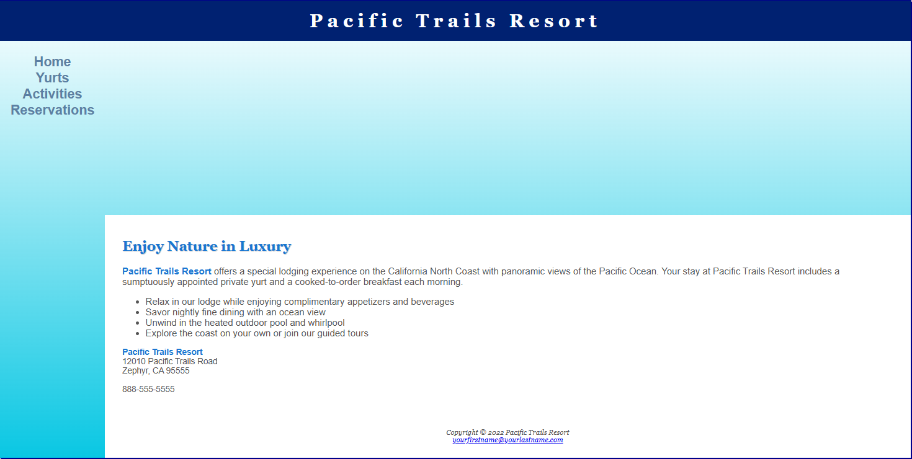

# Project Title: Pacific Trails Resort Webpage

## Description
This project demonstrates the creation of a basic website for the fictional Pacific Trails Resort, aimed at showcasing skills in HTML and CSS. The project includes several pages and features to illustrate various aspects of web design and development.

## Features
- Responsive Design: The website is designed to be responsive, ensuring a good user experience across different device sizes.
- Navigation: A consistent navigation menu across all pages for easy access to different sections of the site.
- Hero Images: Each page includes a hero section with a background image related to the page content (home, activities, and yurts).
- CSS Styling: Utilizes CSS for styling, including grid layout for larger screens and flexible box layout for smaller screens.

## Technologies Used
- HTML
- CSS

## Installation Instructions
To view this project click on this link: https://92d7229c-68fa-452f-877a-0f0fdedabc68-00-3kwncojjptaut.picard.replit.dev/ or copy and paste it into your browser.

## Contributors
- dev-jaser

## Preview
