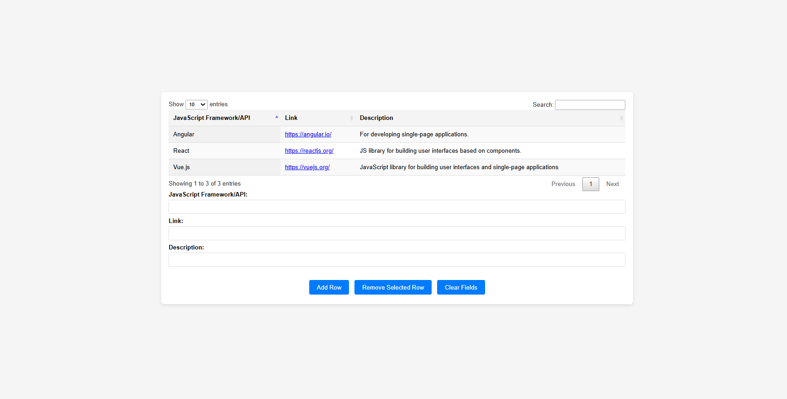

# Project Title: Interactive JavaScript Frameworks Manager

## Description
Interactive JavaScript Frameworks Manager is a dynamic web application that allows users to manage and visualize a list of JavaScript frameworks and libraries. This project leverages advanced web technologies to provide an interactive table with real-time feedback and functionality.

## Technologies Used
HTML: Structures the content and elements of the application.
CSS: Provides styling and layout for the table and other UI components.
JavaScript: Powers the interactive functionality, including adding, removing, and updating table entries.
DataTables: Enhances the table with interactive features such as sorting and pagination.
Toastr: Displays user-friendly notifications for feedback on actions performed.

## Installation Instructions
To view this project click on this link: https://92d7229c-68fa-452f-877a-0f0fdedabc68-00-3kwncojjptaut.picard.replit.dev/ or copy and paste it into your browser.

## Contributors
- dev-jaser

## Preview
