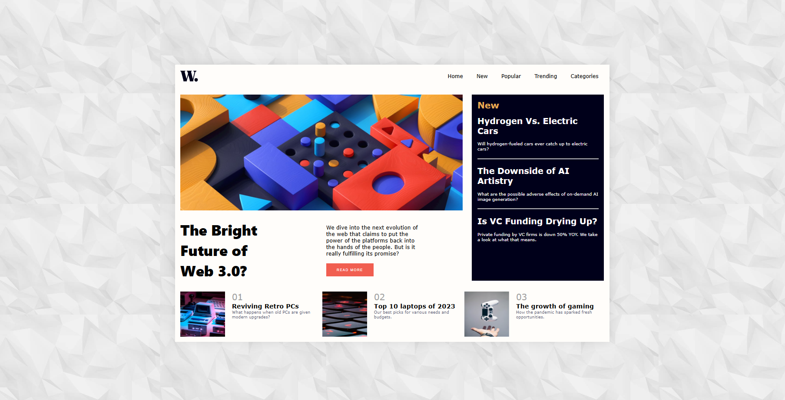

# Project Title: News Homepage

## Description
A responsive news homepage that features the latest articles and news updates. The homepage includes a navigation sidebar, main articles, and a footer section with additional news items. This project showcases modern web development techniques, including responsive design, interactive elements, and a clean, user-friendly layout.

## Technologies Used
- HTML
- CSS
- JavaScript

## Installation Instructions
To view this project click on this link: https://e1f74385-4b9e-4f37-becd-896279a2c395-00-vu2e146fu8rl.janeway.replit.dev/ or copy and paste it into your browser.

## Contributors
- dev-jaser

## Preview

