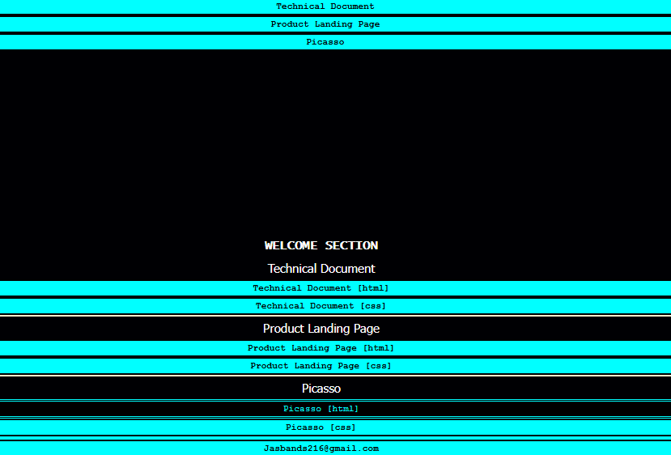

# Project Title: Home Office Network Setup

## Description
A personal portfolio webpage that showcases various projects, including a technical document, a product landing page, and a Picasso-themed project. This portfolio serves as an online resume, highlighting your web development skills and providing links to detailed project files.

## Technologies Used
- HTML
- CSS

## Installation Instructions
To view this project click on this link: https://92d7229c-68fa-452f-877a-0f0fdedabc68-00-3kwncojjptaut.picard.replit.dev/ or copy and paste it into your browser.

## Contributors
- dev-jaser

## Preview
