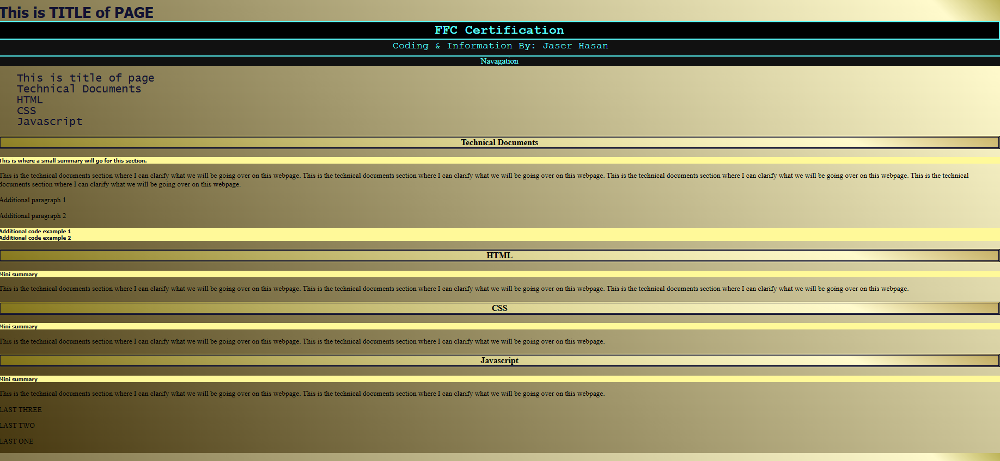

# Project Title: Technical Documentation Page

## Description
This project is a technical documentation webpage designed to showcase a comprehensive overview of various web development topics, including HTML, CSS, and JavaScript. The page includes a navigation bar for easy access to different sections and detailed descriptions, code examples, and summaries for each topic.

## Technologies Used
- HTML
- CSS

## Installation Instructions
To view this project click on this link: https://92d7229c-68fa-452f-877a-0f0fdedabc68-00-3kwncojjptaut.picard.replit.dev/ or copy and paste it into your browser.

## Contributors
- dev-jaser

## Preview
